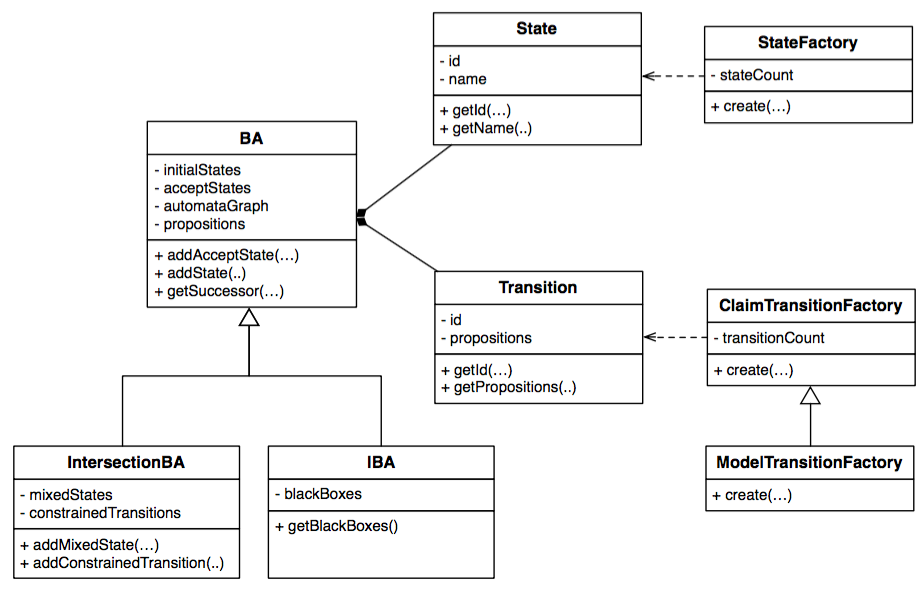

# CHIAAutomata

The *CHIAAutomata* module contains the classes which are used to manage *BAs* and *IBAs*. 

These two classes describe BAs and IBAs using an explicit representation of the state space, which is build upon the JGraphT library. 

The class diagram of the CHIAAutomata module is represented in the following and is hereafter discussed:

* <b>State</b> is used to represent a state of an automaton. Each state has two final attributes, the id and the name} which are returned through the corresponding methods <code>int getId()</code>  and <code>String getName()</code>.

* <b>StateFactory</b> it is used for creating the states of the automaton. It assign an auto-generated id to the state if not specified by the developer. It implements the VertexFactory interface of <code>JGraphT</code>.

* <b>Transition</b> it is used to represent a transition of an automaton (BA or IBA). The transition is identified by an id and it is labeled with a Set of propositions, which are the propositions to be true for the transition to be fired. These propositions are represented using the IGraphProposition interface of the <code>LTL2BA4J</code>. This choice allows to easily integrate the <code>LTL2BA4J</code> library, which support the conversion of LTL formulae into the corresponding BAs.  Note that this representation also allows a proposition to be negated, i.e., to represent a condition that labels a transition of the claim. The set of propositions (negated or not) added to the transitions are considered as being connected by a logical AND. The Transition class which represents the transitions of the automata extends the <code>DefaultEdge</code> class of <code>JGraphT</code>. The id and the propositions are returned through the methods <code>int getId()</code> and <code>Set<IGraphProposition> getPropositions()</code>, respectively.

* <b>ModelTransitionFactory</b> it is used to create the transitions of the model. When the factory creates a transition of the model it checks that there are no negated propositions that decorate the transition, i.e., the propositions specify statements that are true when the transition is performed.

* <b>ClaimTransitionFactory</b> allows to create the transitions of the claims. In the claim case also negated propositions are allowed since the transitions represent conditions that must be satisfied for the transition to be fired.

* <b>BA</b>  contains the description of a Buchi Automaton. The automataGraph attribute of the BA class represents the graph of the automaton using the <code>DirectedPseudograph</code> class of the <code>JGraphT</code> library. The DirectedPseudograph class allows to create a non-simple directed graph in which both graph <i>loops</i> and <i>multiple edges</i> are permitted. The BA attributes include the set of initial states, the set of accepting states,  and the alphabet of the Buchi Automaton. The constructor of the BA requires to specify the transition factory to be used, depending on whether the BA is used to represent the model or the claim to be checked. The BA class provides methods to access the states of the BA, such as the one that allow to get the successors of a state (<code>getSuccessors()</code>) or  the initial states (<code>getInitialStates()</code>) of the BA. 

* <b>IBA</b> models an Incomplete Buchi Automaton. The IBA class extends the BA class. The <code>blackBoxes</code> attribute is used to store the set of states of the IBA which are black box and are accessible by an appropriate getter (<code>getBlackBoxes()</code>).

* <b>IntersectionBA</b> class is used to represent the intersection between a BA and IBA. The intersection automaton extends the <code>BA</code> class. The <code>mixedStates</code> attribute is used to store the set of mixed sates which are obtained by considering a black box states of the model and a state of the claim. The <code>constrainedTransition</code> attribute is used to store the transitions generated by performing a transition of the claim inside a box of the model