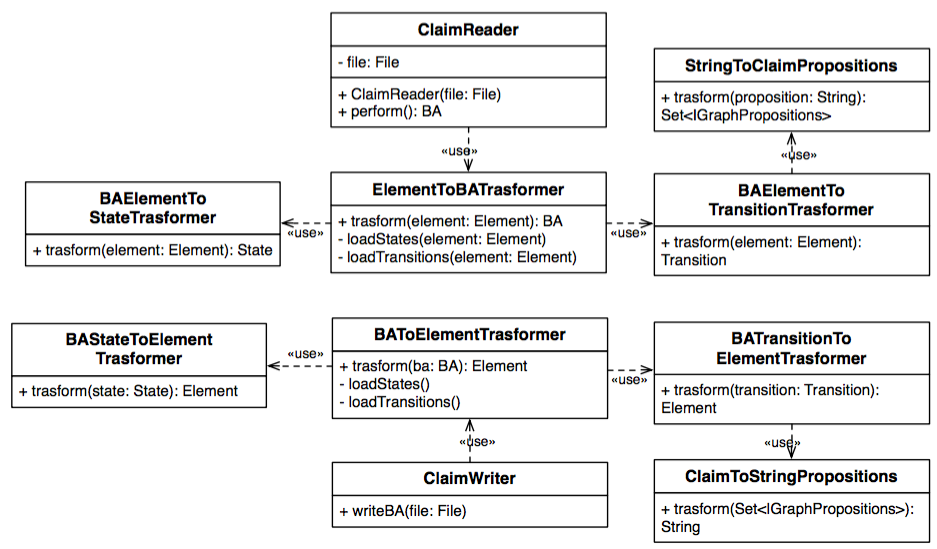

# CHIAAutomataIO

The <code>CHIAAutomataIO</code> module provides the classes to load and save BAs, IBAs and intersection automata from and to an appropriate <code>XML</code> file. The tool directly uses the classes available in the <code>javax.xml.parsers</code> package of Java instead of using existing libraries. This choice has been performed to provide an higher flexibility and customization of the I/O Files. A portion of the class diagram corresponding to the <code>CHIAAutomataIO</code> module, which refers to the <code>BA</code> class is presented in the following figure. The same components are present both for  the <code>IBA</code> and for the <code>IntersectionBA</code> classes with different implementations.

The classes presented in the previous Figure are designed to load a claim from the corresponding XML file:

* <b>ClaimReader</b>: it is used to load a BA from the corresponding <code>XML</code> representation. It is based on the <code>ElementToBATransformer</code> which transforms an <code>XML</code> element into the corresponding BA object;

* <b>ElementToBATransformer</b>: transforms an <code>XML</code> element which represents a BA into the corresponding object;

* <b>BAElementToStateTransformer</b>: transforms an <code>XML</code> element which represents a BA state into the corresponding <code>State</code> object;

* <b>BAElementToTransitionTransformer</b>: transforms an <code>XML</code> element which represents a BA transition into the corresponding <code>Transition</code> object;

* <b>StringToClaimPropositions</b>: transforms a <code>String</code> which specifies  the propositions that decorate the transition into the corresponding <code>Set</code> of <code>IGraphProposition</code>.

Other classes  are designed to write a claim on an XML file:

* <b>ClaimWriter</b>: it is used to write a BA to the corresponding <code>XML</code> file. It uses the <code>BAToElementTrasformer</code> which transforms a BA object into the corresponding <code>XML</code> element;

* <b>BAToElementTrasformer</b>: it is used to transform a BA into the corresponding <code>XML</code> element;

* <b>BAStateToElementTrasformer</b>: it is used to transform a State object into the corresponding <code>XML</code> representation;

* <b>BATransitionToElementTrasformer</b>: it is used to transform a Transition object into the corresponding <code>XML</code> representation;

* <b>ClaimToStringPropositions</b>: it is used to tramsform a set of propositions into the corresponding <code>String</code> representation.

The structure of the <code>XML</code> files which contain the Buchi and the Incomplete Buchi automata is specified in the <code>BA.xsd</code> and the <code>IBA.xsd</code> files.
