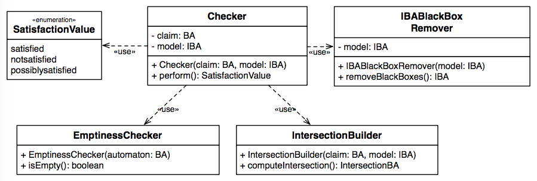

# CHIAChecker

The <code>CHIAChecker</code> module contains the classes which allow checking whether a model described through an IBA <i>satisfies</i>, <i>does not satisfy</i> or <i>possibly satisfies</i> a claim of interest. The class diagram corresponding to the <code>CHIAChecker</code> module is presented in the following.

* <b>SatisfactionValue</b> is an enumeration that contains the possible results of the model model checking activity: <i>satisfied</i>, <i>notsatisfied</i> or <i>possiblysatisfied</i>;

* <b>Checker</b> contains the entry point used run the model checking tool. It requires as input a BA and an IBA. The <code>perform</code> method returns one of the satisfaction values depending on the checking result. The checker uses  the <code>IBABlackBoxRemover</code>, the <code>IntersectionBuilder</code> and the <code>EmptinessChecker</code> classes.

* <b>IBABlackBoxRemover</b>  is used to remove the black box states and their incoming and outgoing transitions from the IBA used to represent the model. In particular, the method <code>removeBlackBoxes()</code> returns a copy of the IBA where the black box states are removed.

* <b>IntersectionBuilder</b> computes the intersection between a model (expressed as an IBA) and a claim (expressed as a BA). 

* <b>EmptinessChecker</b> checks the emptiness of an automaton. It implements the double DFS algorithm. The method <code>isEmpty()</code> returns <code>true</code> if the automaton is empty, i.e., when it does not exists an infinite path that contains an accepting state that can be accessed infinitely often, <code>false</code> otherwise.

