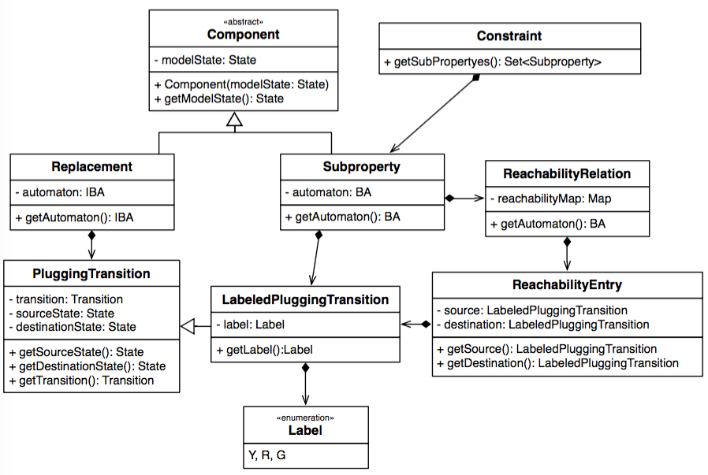

# CHIAConstraint

The <code>CHIAConstraint</code> module contains the classes which are used to describe <i>constraints</i>, <i>sub-properties</i> and  <i>replacements</i>. 

The class diagram of the <code>CHIAConstraint</code> module is presented in following Figure. 

The main components of the module are:

  
* <b>Component</b>: is the abstract class which is used to describe components, i.e., replacements and sub-properties. Each component refers to a particular state which is represented by the final attribute <b>modelState</b>;

* <b>Replacement</b>: it is used to represent a replacement. It extends the <code>Component</code> class with the  IBA which is used to refine the black box state and the set of the <code>PluggingTransition</code> which specifies how the replacement is connected to the original model;

* <b>SubProperty</b>: contains the description of a sub-property. The <code>Subproperty</code> class extends the <code>Component</code> by specifying the BA which describes the claim the developer must consider in the refinement process. The sets of <code>LabeledPluggingTransition</code>s associated with the sub-property specify how the sub-property is related with the original model. The reachability relation specifies the reachability between the incoming and outgoing transitions.

* <b>PluggingTransition</b> is used to describe how the automaton that refers to the sub-property/replacement associated with a box is connected with the states of the original model. The <code>PluggingTransition</code>  class contains the <code>source</code>, <code>destination</code> and <code>transition attributes</code>, i.e., the source and the destination state of the incoming/outgoing transition, and the transition itself. Depending on whether the <code>PluggingTransition</code>  represents an incoming or an outgoing transition the source or the destination state corresponds with a state of the model.
 
* <b>LabeledPluggingTransition</b> is used to represent the incoming and outgoing transitions associated with a sub-property. These transitions are also associated with a label. The class <code>Label</code> is an enumeration that contains the three different values that can be associated to these transitions.

* <b>ReachabilityRelation</b> contains a map which specifies for each state that is a destination of the outgoing transition of the sub-property the set of reachable incoming transitions  of the same sub-property. It is bases on a set of reachability entries described in the <code>ReachabilityEnty</code> class. 

* <b>Constraint</b> contains a set of sub-properties (at most one for each black box state) that specifies the set of the claims  the developer must satisfy in the refinement process.

  