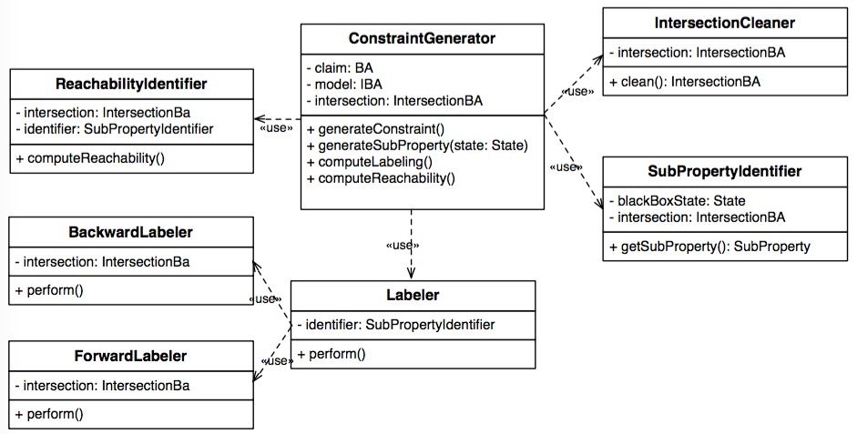

# CHIAContraintComputation

The <code>CHIAContraintComputation</code> module is used  when the property is <i>possibly</i> satisfied to compute the sub-property associated to each black box state. 

The class diagram of the module is represented the following.

* <b>ConstraintGenerator</b>: contains the entry point for the constraint computation. Given the model, the claim and the intersection automaton computed by the <code>CHIA</code> checker, the <code>ConstraintGenerator</code> class computes the corresponding constraint. The computation of the label associated to each incoming and outgoing transitions and of the reachability relation are implemented as features that can be conveniently activated and deactivated;

* <b>IntersectionCleaner</b>: implements the cleaning procedure, i.e., it removes from the intersection automaton the states from which it is not possible to reach an accepting state, since these states are not useful in the constraint computation;

* <b>SubPropertiesIdentifier</b>: extracts the sub-properties from the intersection automaton, by identifying  the portions of the state space (the set of the mixed states and the transitions between them) that refer to the same box of the model;

* <b>Labeler</b>: computes the values associated with the incoming and outgoing transitions of the sub-properties. It uses the two functions <code>BackwardLabeler</code> and <code>ForwardLabeler</code>  which implement the algorithms to find the <i>G</i>, <i>Y</i> and <i>R</i> transitions;
 
* <b>ReachabilityIdentifier</b>: computes for each sub-property the upper and the lower reachability relations.

