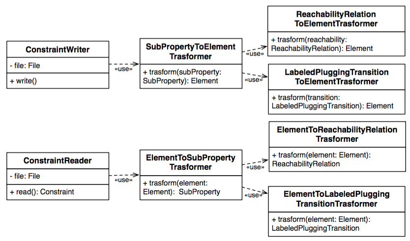

# CHIAConstraintIO

The <code>CHIAConstraintIO</code> module contains the utilities which are used to load and save the constraint and the replacement from and to XML files. 

The class diagram associated with the <code>Constraint</code> class of the <code>CHIAConstraint</code> module is presented in the following. The same classes with different implementations are associated with the <code>Replacement</code>.

* <b>ConstraintWriter</b>: it is used to write a constraint into an appropriate file;

* <b>SubPropertyToElementTrasformer</b>: it is used to  transform the sub-property into the corresponding XML element;

* <b>ReachabilityRelationToElementTrasformer</b>: it is used to convert the reachability relation between the incoming and the outgoing transitions of the sub-property into the corresponding XML elements;

* <b>LabeledPluggingTransitionToElementTransformer</b>: it converts an incoming or outgoing transition of the sub-property into the corresponding XML element;

* <b>ConstraintReader</b>: given an XML input file, the it is used to load the constraint from the file;

* <b>ElementToSubPropertyTrasformer</b>: it is used to convert an XML element into the corresponding sub-property;

* <b>ElementToReachabilityRelationTrasformer</b>: converts an XML element into the corresponding reachability relation object;

* <b>ElementToLabeledPluggingTransitionTrasformer</b>: converts an XML element into the corresponding incoming or outgoing transition.

