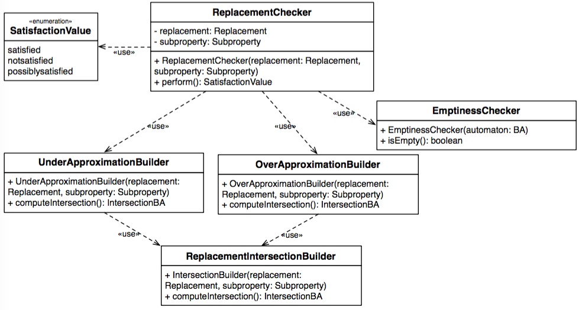

# CHIAReplacementChecker

The <code>CHIAReplacementChecker</code> module contains the classes that allow checking whether the replacement satisfies the corresponding constraint. 

The class diagram of the <code>CHIAReplacementChecker</code> module is presented in the following.

* <b>ReplacementChecker</b>: is the entry point of the module. It takes as input the sub-property and a replacement for one of the black box states involved in the constraint. As the <code>Checker</code> class, it returns a value specified by the  <code>SatisfactionValue</code> enumeration depending on whether the replacement satisfies, possibly satisfies or does not satisfy the property of interest;

* <b>UnderApproximationBuilder</b>: is used to compute the under approximation of the intersection automaton. It uses the <code>ReplacementIntersectionBuilder</code>;

* <b>OverApproximationBuilder</b>: is used to compute the over approximation of the intersection automaton.  It uses the <code>ReplacementIntersectionBuilder</code>;

* <b>ReplacementIntersectionBuilder</b> computes the intersection between the automaton associated with the replacement and the one of the corresponding sub-property. This automaton is used by the <code>UnderApproximationBuilder</code> and the <code>OverApproximationBuilder</code> to compute the under and over approximation, respectively.